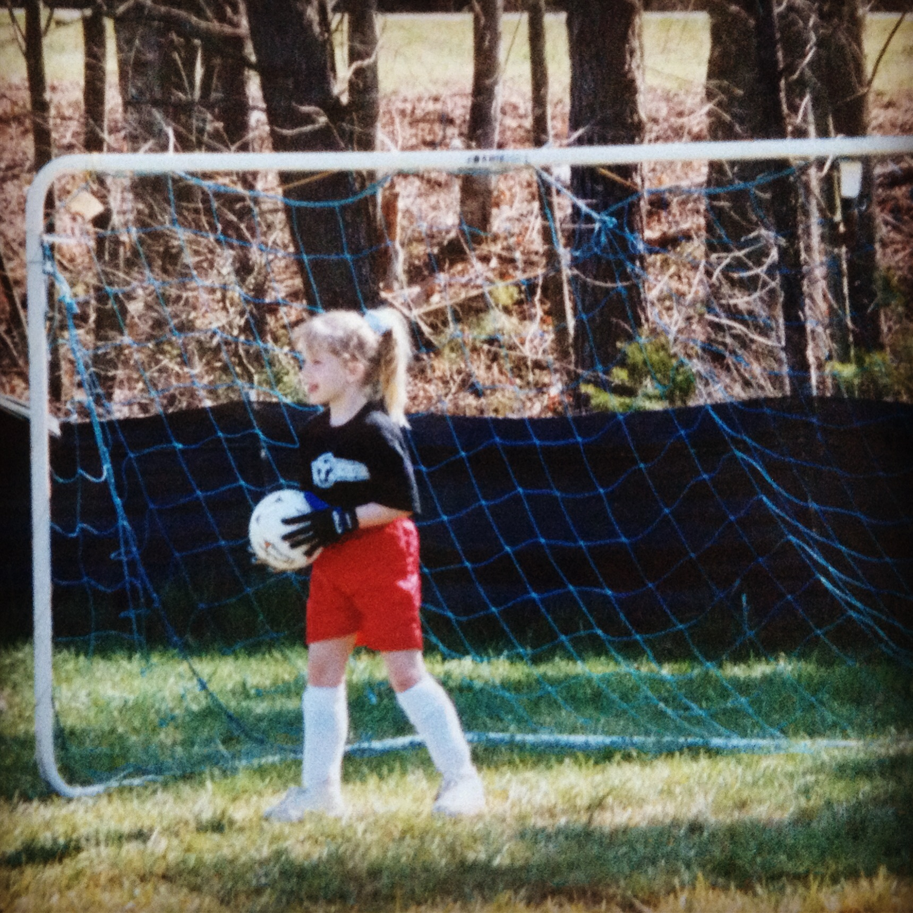
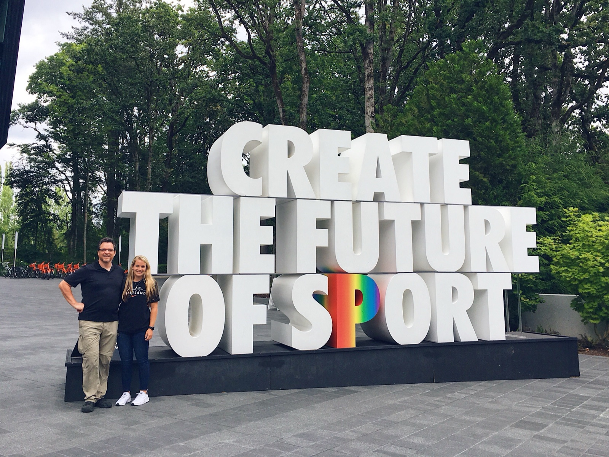
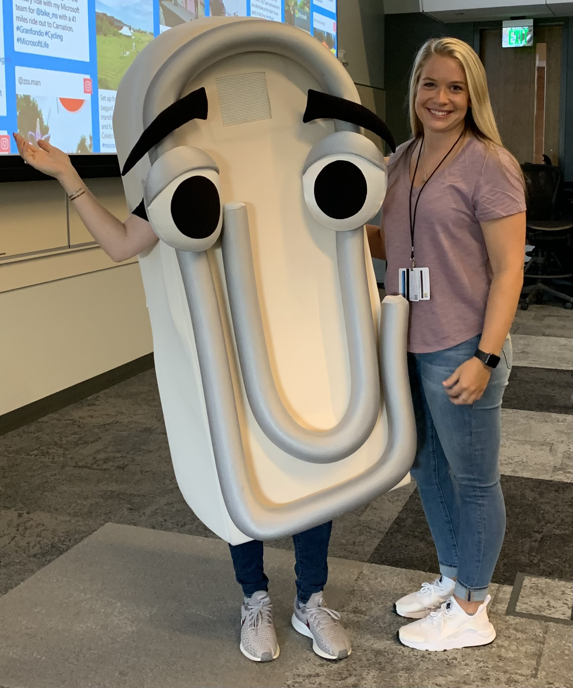
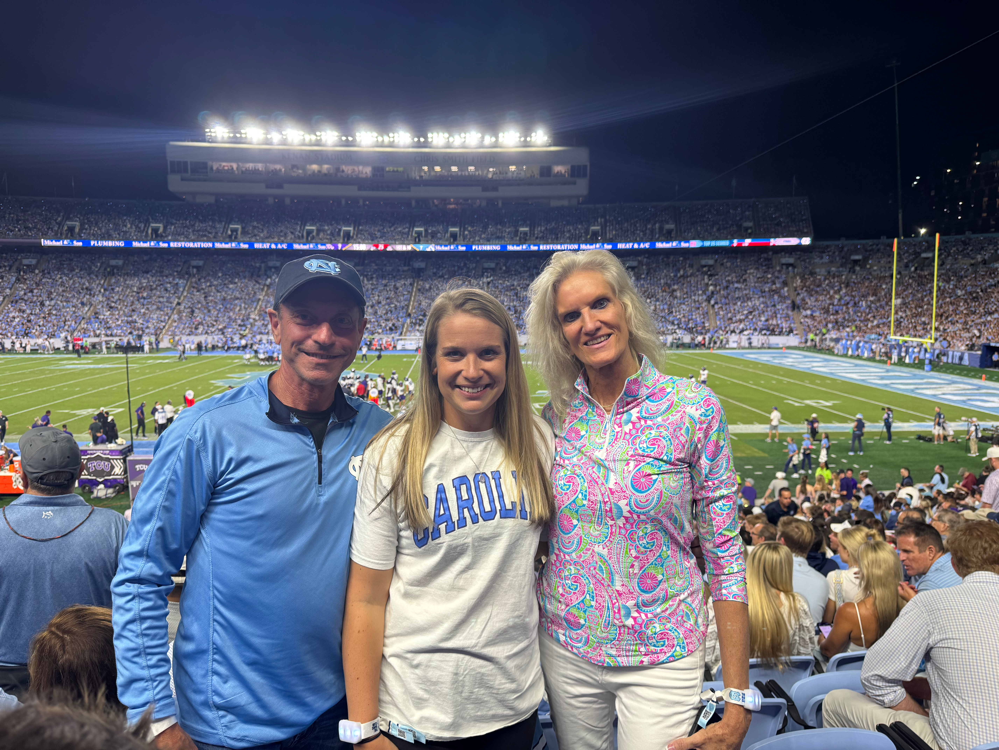
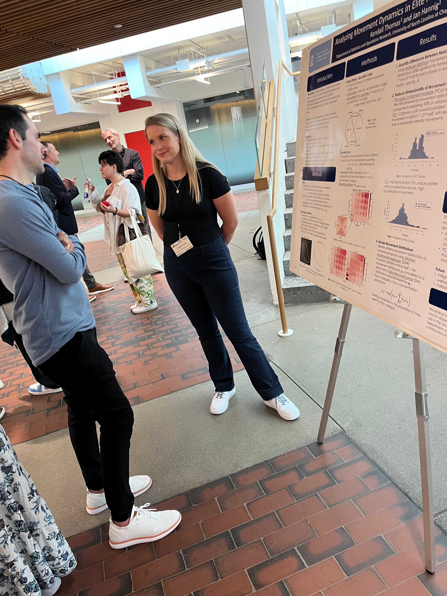
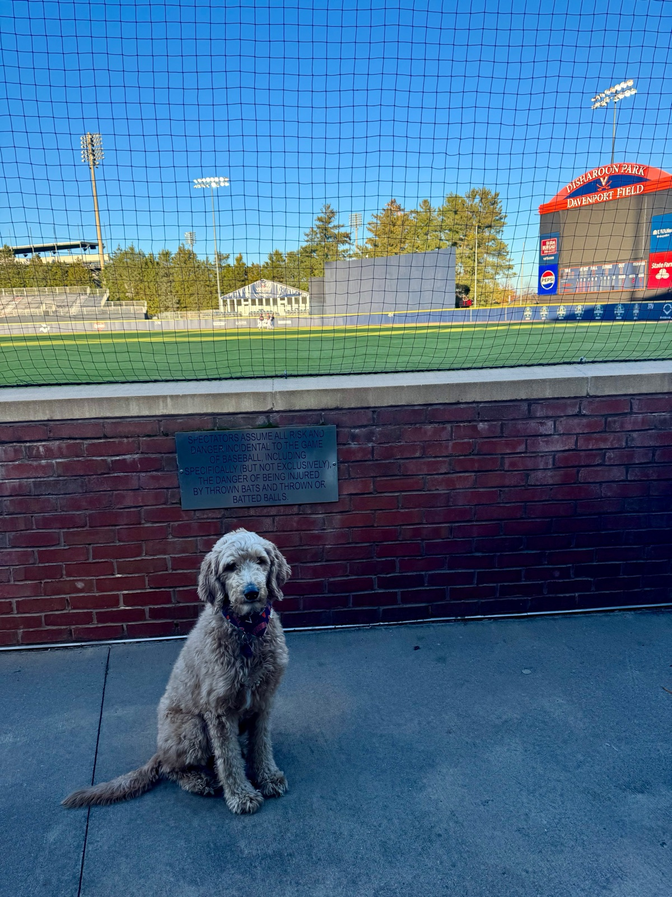
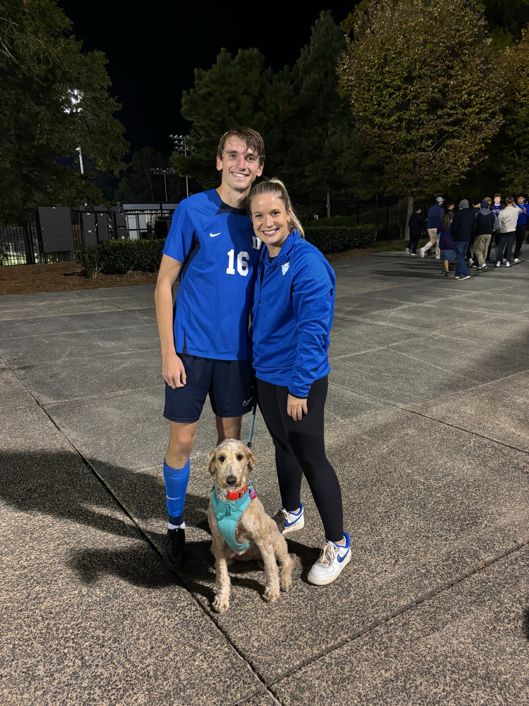
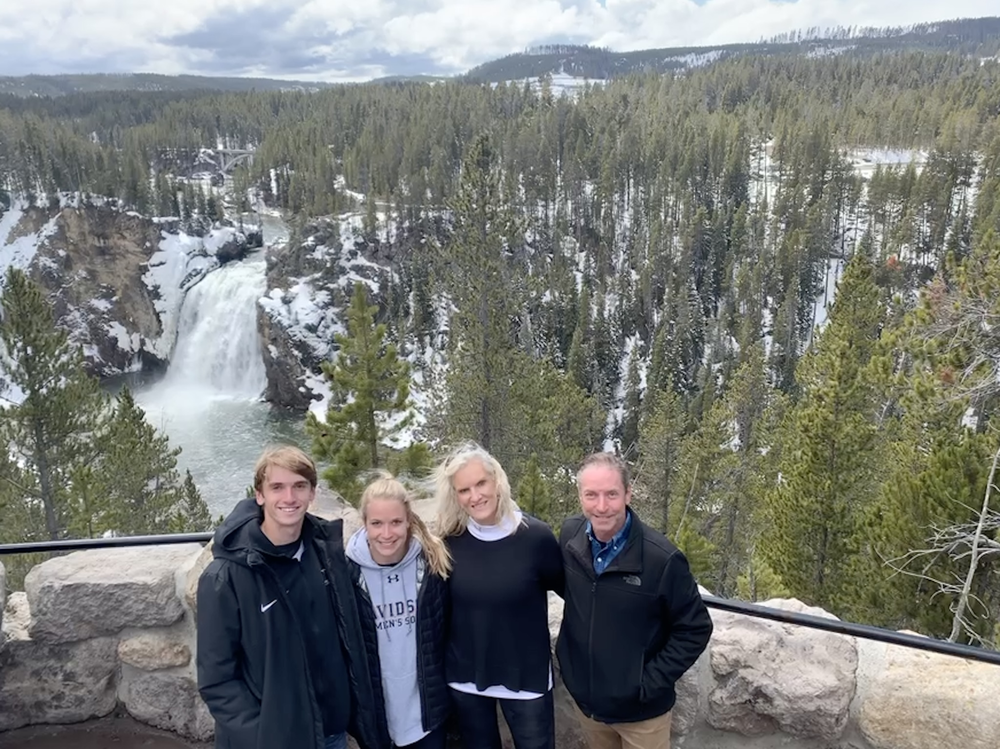
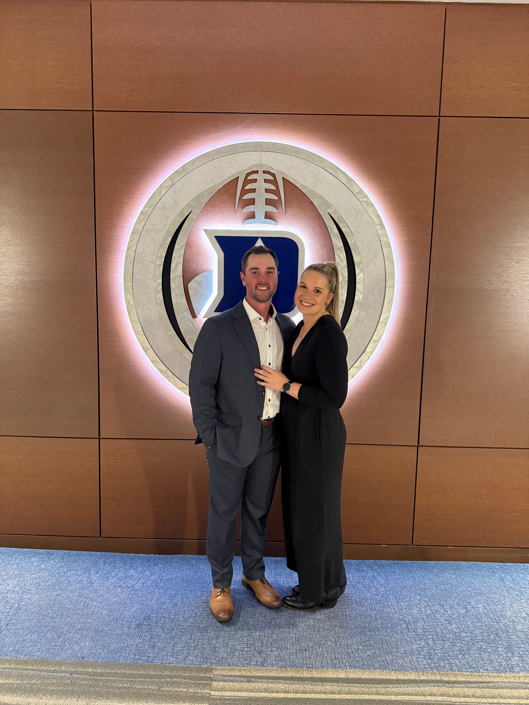

```{=html}
<style>
  /* Forces the main content area to be 1200px and centered */
  .quarto-container {
    max-width: 1200px !important;
    margin: 0 auto !important;
  }
  
  /* Ensures the gallery at the bottom doesn't break out of that width */
  .quarto-layout-panel {
    max-width: 1200px !important;
    margin: 0 auto !important;
  }

  /* Vertical centering helper for columns */
  .v-center {
    display: flex;
    flex-direction: column;
    justify-content: center;
  }
</style>
```

::::: columns
::: {.column width="25%"}
{fig-alt="small child soccer" style="border-radius:4px;"}
:::

::: {.column width="75%" style="padding-left: 10px;"}
I entered college in the fall of 2015 not entirely sure what I wanted to study — I knew I was good at math, and I had committed to play soccer at Davidson College. However, before my freshman season, I tore my ACL, and over the next few years, I would re-tear it four more times — five ACL reconstructions in total. 

During my freshman year, I sought out Dr. Tim Chartier and joined 'Cats Stats, Davidson's sports analytics group. Through 'Cats Stats, I discovered that I could make an impact for my team *without physically being on the field* — by using data to analyze performance and strategy. 
:::
:::::

::::: columns
::: {.column width="75%" style="padding-right: 20px;"}
To deepen that work, I began taking computer science courses alongside my math major, ultimately double majoring in Mathematics and Computer Science. I interned with **Nike** and **Athlete Intelligence**, where I explored the intersection of performance data, technology, and athlete development.
:::

::: {.column width="25%"}
{fig-alt="Internship experience" style="border-radius:4px;"}
:::
:::::

::::: columns
::: {.column width="25%"}
{fig-alt="Microsoft" style="border-radius:4px;"}
:::

::: {.column width="75%" style="padding-left: 20px; justify-content: center;"}
After graduating, I joined **Microsoft** as a Software Engineer. I worked on the Azure Data Query Processing Team, focusing on query performance and leading supportability efforts. While I learned a tremendous amount about large-scale data systems, I missed the sports component — and I missed teaching.
:::
:::::
::::: columns
::: {.column width="75%" style="padding-right: 20px;"}
That realization led me to pursue a Ph.D. in Statistics and Operations Research (STOR) at UNC Chapel Hill. During my Ph.D., I've taught several upper-level courses and fully redesigned **STOR 320: Methods and Models of Data Science** to introduce a Python-based section. I've found that I love teaching — especially where coding, statistics, and real-world application intersect.
:::

::: {.column width="25%"}
{fig-alt="UNC Teaching" style="border-radius:4px;"}
:::
:::::


::::: columns
::: {.column width="25%"}
{fig-alt="SAIL research" style="border-radius:4px;"}
:::

::: {.column width="75%" style="padding-left: 20px;"}
My research centers on statistical methods in sports analytics, specifically modeling movement dynamics in female athletes to improve performance and reduce injury risk. I also lead the **Sports Analytics Intelligence Lab (SAIL)** at UNC, mentoring students working on projects for UNC's athletic teams.
:::
:::::

::::: columns
::: {.column width="75%" style="padding-right: 20px; "}
When I'm not teaching or working on research, you'll usually find me hiking, working out, or spending time with my dog, **Willow**. My fiancé, Eric, is a baseball coach at UVA, and we're both originally from the Charlotte area. I've always enjoyed staying active — whether that's lifting, cycling, or exploring new trails.
:::

::: {.column width="25%"}
{fig-alt="Personal" style="width: 100%; border-radius:4px;"}
:::
:::::

::: {layout-ncol="3"}
{style="height: 350px; width: 100%; object-fit: cover; border-radius: 2px;"}

{style="height: 350px; width: 100%; object-fit: cover; border-radius: 2px;"}

{style="height: 350px; width: 100%; object-fit: cover; border-radius: 2px;"}
:::
