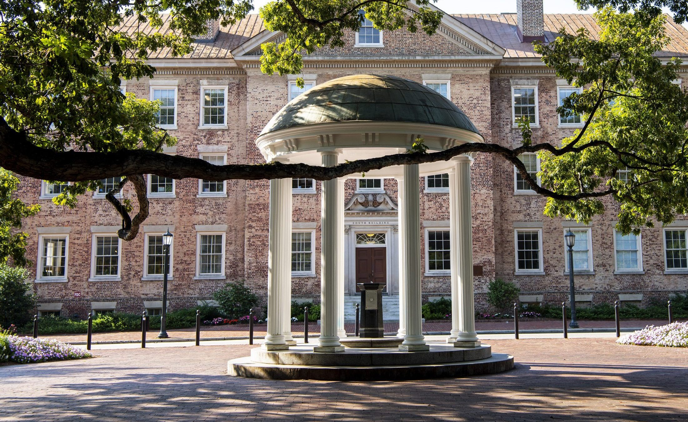
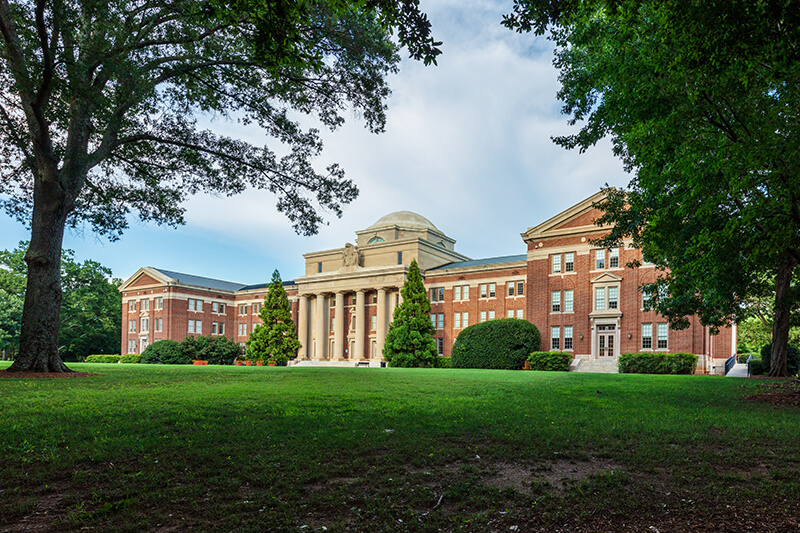

::: {style="text-align: center;"}
## University of North Carolina at Chapel Hill
:::

:::::: columns
::: {.column width="60%" style="text-align:left;"}
**Ph.D. Candidate**, Statistics and Operations Research (STOR)\
*Expected May 2027*\
Advised by [Dr. Jan Hannig](https://hannig.cloudapps.unc.edu)

**M.S. Statistics, Analytics, and Data Science**, *Dec. 2025*

**Leadership**

-   Principal, [Sports Analytics Intelligence Lab (SAIL)](https://supermariogiacomazzo.github.io/sports-analytics-intelligence-laboratory/)
-   Graduate Student Liaison, STOR Department

**Awards**

-   Druscilla French Graduate Student Excellence Award\
    (Fall 2025 - Spring 2026)\
-   Walter Deemer Excellence in Teaching Award (Fall 2024)\
-   Excellence in Teaching Assistance and Instruction Award (Fall 2023)
:::

:::: {.column width="40%" style="align-items: center;"}
::: {style="display: flex; justify-content: center;"}
{fig-alt="UNC Chapel Hill Old Well" style="border-radius:12px; width:90%;"}
:::
::::
::::::

------------------------------------------------------------------------

::: {style="text-align: center;"}
## Davidson College
:::

:::::: columns
:::: {.column width="40%" style="align-items: center;"}
::: {style="display: flex; justify-content: center;"}
{fig-alt="Davidson College Chambers Building" style="border-radius:12px; width:90%; margin:auto; display:block;"}
:::
::::

::: {.column width="60%" style="text-align:left;"}
**B.S. Mathematics, B.S. Computer Science**\
Magna Cum Laude (2019)

-   Sports Analytics Research with [Dr. Tim Chartier](https://www.davidson.edu/people/tim-chartier)
-   4-Year Varsity Athlete, NCAA Division I Women’s Soccer
    -   A-10 Commissioner’s Honor Roll (all semesters)

**Honors:** Phi Beta Kappa, Omicron Delta Kappa

**Leadership**

-   President, Females in Computer Science and Information Technology\
-   Lead Analyst, ['Cats Stats](https://catsstats.timchartier.com/)
:::
::::::
